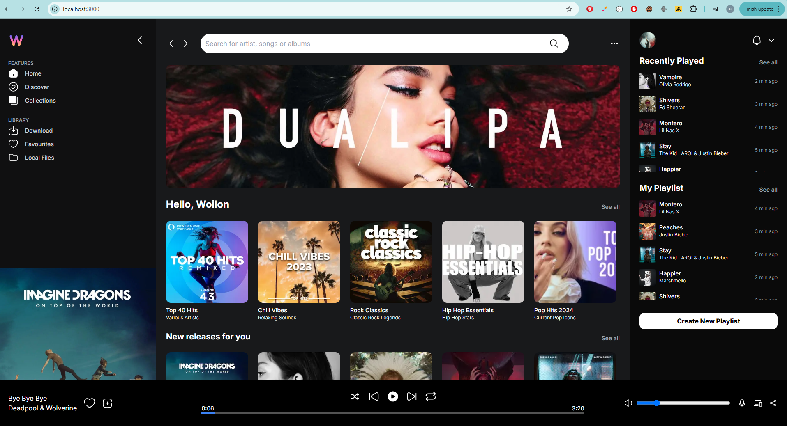
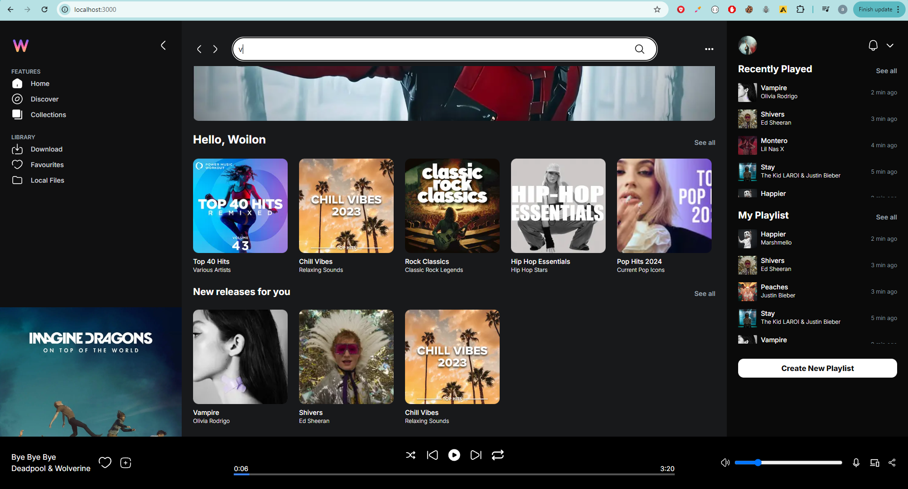
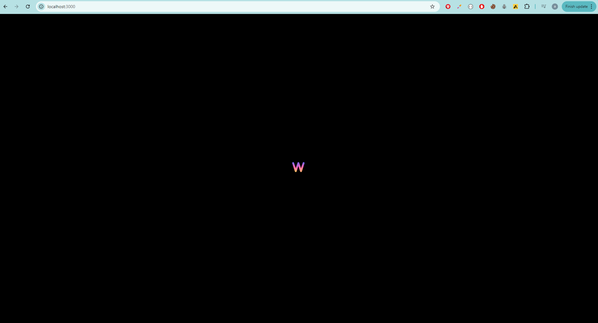
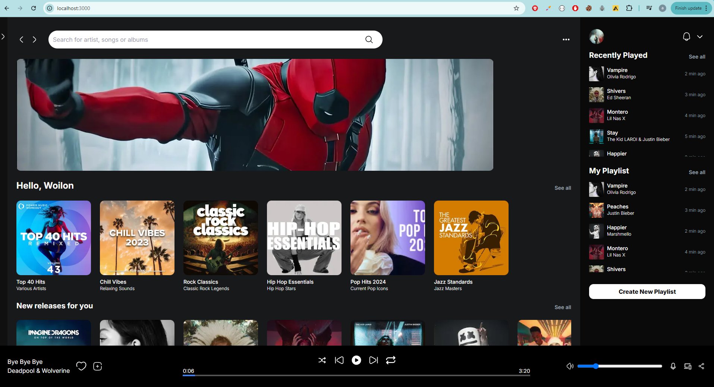
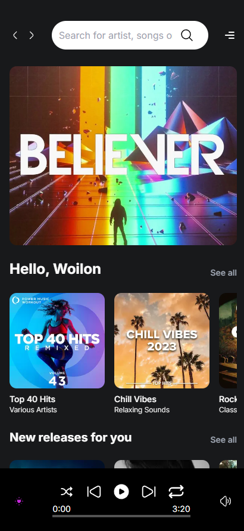
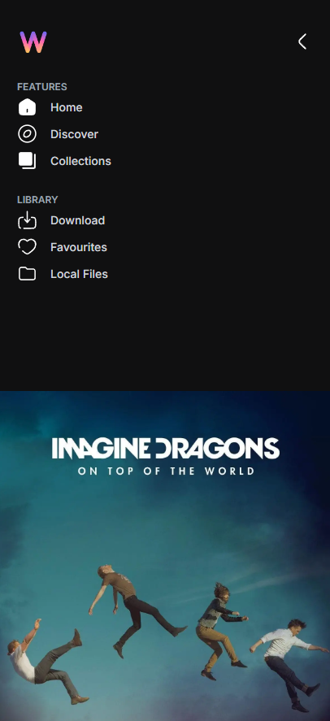
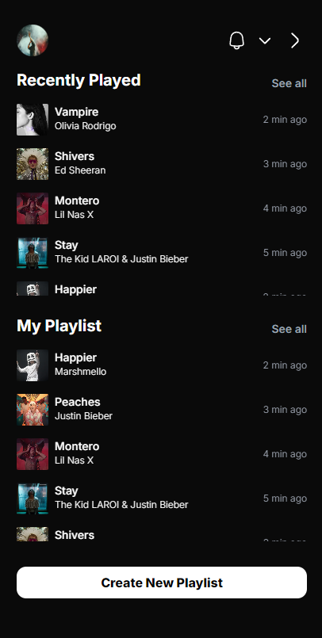
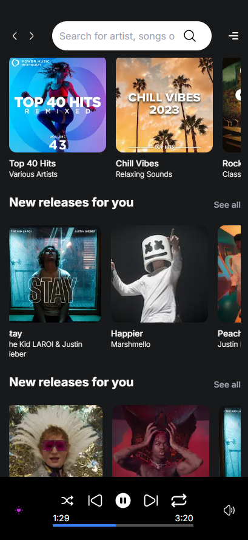

# Wemsc Music Player

## Overview

This project is built with Next.js, TailwindCSS, and TypeScript. The music application features a search function, playlist management, the ability to like and play music, and a clean, user-friendly UI.

### Live Link

https://wemsc-music-app.vercel.app/


## Images
<br>

<br>

<br>

<br>

<br>

<br>

<br>

<br>

<br>
<br>


## Features

### Music App:

- View songs, search, and view details.
- Responsive design
- Play/Pause music
- Like songs
- Volume Control
- Playlist 
<br>

## Future Improvement 

- Using spotify API to fetch and play music using OAuth authentication token based authorization.


## Getting Started

Project Setup
Clone the repository:

``` bash
git clone https://github.com/Akayush-17/Wemsc--Music-App.git

Install dependencies:

npm install

npm run dev
```


